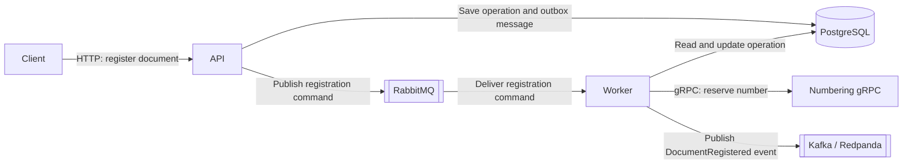
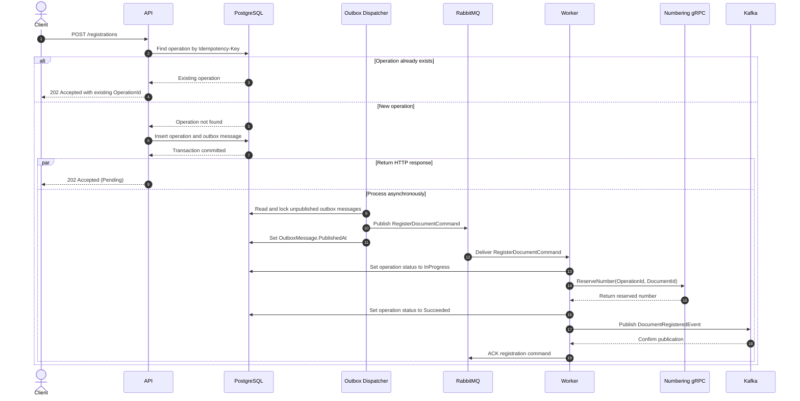

# Distributed Workflow

## Overview

Distributed Workflow is an educational .NET system that models an asynchronous document registration pipeline.
It demonstrates how an idempotent HTTP request is converted into a durable operation and an outbox command.

The repository provides a hands-on environment for studying distributed-system patterns, containerized infrastructure, observability, and automated testing.
It is not intended to be a production-ready document management system.

## Architecture



## Document registration flow



## Services

| Service | Responsibility | Communication |
|---|---|---|
| `DistributedWorkflow.Api` | Accepts idempotent document registration requests, persists operations and outbox messages, and dispatches pending commands. | HTTP, PostgreSQL, RabbitMQ |
| `DistributedWorkflow.Worker` | Consumes registration commands, updates operation status, obtains registration numbers from the Numbering service over gRPC, publishes `DocumentRegisteredEvent` to Kafka, and acknowledges or rejects RabbitMQ deliveries. | RabbitMQ, PostgreSQL, gRPC, Kafka |
| `DistributedWorkflow.Numbering.Grpc` | Reserves registration numbers using a process-local in-memory counter. | gRPC |

## Infrastructure

| Component | Role |
|---|---|
| PostgreSQL | Stores registration operations and transactional outbox messages shared by the API and Worker. |
| RabbitMQ | Delivers registration commands to Worker. |
| Redpanda | Provides Kafka-compatible event streaming between the Worker and StatusUpdater service. |
| Prometheus | Scrapes and stores metrics exposed by the API through the OpenTelemetry Prometheus exporter. |
| Grafana | Visualizes Prometheus metrics through configurable dashboards. |

## Technology stack

- **Platform:** .NET 9, ASP.NET Core, .NET Worker Services
- **Data access:** PostgreSQL, Entity Framework Core, Npgsql
- **Messaging and communication:** RabbitMQ, Kafka-compatible Redpanda, gRPC
- **Observability:** OpenTelemetry Metrics, Prometheus, Grafana
- **Testing:** xUnit v3, Moq, Testcontainers for .NET, `WebApplicationFactory`
- **Deployment:** Docker, Docker Compose

## Running locally

### Prerequisites

- .NET 9 SDK
- Docker Desktop with Docker Compose
- A trusted ASP.NET Core development certificate for the local HTTPS gRPC endpoint

Trust the development certificate if necessary:

```bash
dotnet dev-certs https --trust
```

### Infrastructure in Docker, applications on the host

This mode is intended for local development and debugging from Visual Studio or another IDE. Docker Compose starts only the infrastructure, while the .NET applications run directly on the host.

Start the infrastructure from the repository root:

```bash
docker compose up -d
```

Apply the Entity Framework Core migrations. The API starts in migration mode, updates PostgreSQL, and exits without starting the web server:

```bash
dotnet run --project DistributedWorkflow.Api/DistributedWorkflow.Api.csproj --launch-profile http -- --RunMigrations=true
```

Start each application in a separate terminal, or configure the IDE to launch them together:

```bash
dotnet run --project DistributedWorkflow.Numbering.Grpc/DistributedWorkflow.Numbering.Grpc.csproj --launch-profile https
dotnet run --project DistributedWorkflow.Api/DistributedWorkflow.Api.csproj --launch-profile http
dotnet run --project DistributedWorkflow.Worker/DistributedWorkflow.Worker.csproj
```

The applications use the `Development` configuration, which connects to the infrastructure through the host ports defined in `docker-compose.yml`.

### Fully containerized environment

Use the `apps` profile to build and start both the infrastructure and all .NET applications:

```bash
docker compose --profile apps up -d --build
```

The one-shot `migrations` service applies the database migrations before the API and Worker start.

Stop and remove the complete environment:

```bash
docker compose --profile apps down
```

Add `-v` only when the persisted PostgreSQL and Redpanda data should also be deleted:

```bash
docker compose --profile apps down -v
```

### Local endpoints

| Component | URL or address |
|---|---|
| API and Swagger UI | <http://localhost:5268/swagger> |
| API liveness | <http://localhost:5268/health/live> |
| API readiness | <http://localhost:5268/health/ready> |
| Numbering gRPC | `https://localhost:7158` when run on the host; `http://localhost:5082` when run in Docker |
| RabbitMQ Management | <http://localhost:15672> |
| Redpanda Console | <http://localhost:8080> |
| Prometheus | <http://localhost:9090> |
| Grafana | <http://localhost:3000> |
| PostgreSQL | `localhost:5433` |
| Kafka-compatible endpoint | `localhost:19092` |

## API usage

The registration API accepts a document and returns an operation identifier immediately. Processing continues asynchronously, so clients use the operation identifier to retrieve the current status.

### Register a document

```http
POST /registrations
Idempotency-Key: registration-example-001
Content-Type: application/json

{
  "documentId": "document-123",
  "title": "Example document"
}
```

| Input | Location | Type | Required | Description |
|---|---|---|---|---|
| `Idempotency-Key` | Header | string | Yes | Identifies the logical request. Repeating the same key returns the existing operation instead of creating another one. |
| `documentId` | JSON body | string | Yes | Identifies the document being registered. |
| `title` | JSON body | string | Yes | Human-readable document title. |

A valid request returns `202 Accepted` because processing has been queued rather than completed:

```json
{
  "operationId": "5103c020dff1475c90d1afbdbf9ccd4d",
  "status": "Pending"
}
```

The API returns `400 Bad Request` when the `Idempotency-Key` header is missing or empty.

### Get registration status

Use the `operationId` returned by the registration request:

```http
GET /registrations/5103c020dff1475c90d1afbdbf9ccd4d
Accept: application/json
```

An existing operation returns `200 OK`:

```json
{
  "operationId": "5103c020dff1475c90d1afbdbf9ccd4d",
  "status": "Succeeded"
}
```

The current workflow moves through `Pending`, `InProgress`, and `Succeeded`. An unknown operation identifier returns `404 Not Found`.

Runnable examples are available in [`DistributedWorkflow.Api.http`](DistributedWorkflow.Api/DistributedWorkflow.Api.http) and through Swagger UI at <http://localhost:5268/swagger>.

## Testing

The repository contains separate unit and integration test projects.

Run the unit tests:

```bash
dotnet test DistributedWorkflow.Api.UnitTests/DistributedWorkflow.Api.UnitTests.csproj
```

Run the integration tests:

```bash
dotnet test DistributedWorkflow.Api.IntegrationTests/DistributedWorkflow.Api.IntegrationTests.csproj
```

The integration tests cover:

- PostgreSQL health check
- liveness and readiness endpoints
- registration operation and outbox message persistence
- sequential idempotent requests
- concurrent requests with the same idempotency key

The integration tests use Testcontainers to create isolated PostgreSQL container. Docker must be running, but the development environment from `docker-compose.yml` is not required.

## Observability

The API exposes metrics at <http://localhost:5268/metrics> through the OpenTelemetry Prometheus exporter. ASP.NET Core, HTTP client, runtime, and custom application metrics are collected.

The custom metrics include:

| Metric | Description |
|---|---|
| `registrations.created` | Number of registration operations successfully created. |
| `outbox.published` | Number of outbox messages successfully published to RabbitMQ. |
| `outbox.failed` | Number of failed attempts to publish outbox messages. |

Prometheus scrapes the API metrics endpoint every five seconds. Its query interface is available at <http://localhost:9090>.

Grafana is available at <http://localhost:3000> with the default local credentials `admin` / `admin`. Dashboards are not provisioned automatically. Configure Prometheus as a Grafana data source using the internal Compose address:

```text
http://prometheus:9090
```

The current observability setup covers metrics only. Distributed tracing and centralized log aggregation are not implemented yet; application logs are written to the standard console output.

## Known limitations

- The Numbering service uses a process-local in-memory counter. Its state is lost after a restart, and multiple replicas could generate duplicate registration numbers.
- The API and Worker share the same PostgreSQL database and registration schema, which creates tight coupling and does not provide independent data ownership.
- The Worker marks an operation as `Succeeded` before publishing `DocumentRegisteredEvent` to Kafka. These actions are not atomic, so a Kafka failure can leave a successful operation without its integration event.
- Failed RabbitMQ deliveries are rejected with `requeue: false`, and no dead-letter exchange is configured. A transient processing failure can therefore discard a registration command permanently.
- The transactional outbox provides at-least-once publication rather than exactly-once delivery. A failure after publishing to RabbitMQ but before persisting `PublishedAt` can produce duplicate commands, so consumers must remain idempotent.
- Authentication, authorization, production secret management, and production TLS configuration are outside the current project scope. Credentials in `docker-compose.yml` are intended for local development only.

## Roadmap

### Reliability

- [ ] Make the operation status update and Kafka event creation atomic by introducing an outbox for integration events.
- [ ] Add bounded retries, dead-letter queues, and explicit poison-message handling for RabbitMQ consumers.
- [ ] Add consumer-side inbox/idempotency guarantees for commands and integration events.
- [ ] Replace the in-memory numbering counter with persistent, idempotent number allocation.

### Testing and delivery

- [ ] Add Worker integration tests covering RabbitMQ, PostgreSQL, gRPC, and Kafka interactions.
- [ ] Add end-to-end tests for the complete document registration flow and its failure scenarios.
- [ ] Add a GitHub Actions pipeline for build, test, and Docker image validation on pull requests.

### Observability and security

- [ ] Add distributed tracing and correlation identifiers across HTTP, RabbitMQ, gRPC, and Kafka boundaries.
- [ ] Introduce structured centralized logging, provisioned Grafana dashboards, and actionable alerts.
- [ ] Add authentication, authorization, secret management, and production-grade transport security.

### Architecture and scale

- [ ] Clarify service data ownership and remove direct database sharing where independent ownership provides a concrete benefit.
- [ ] Define service-level objectives, run load tests, and identify measured bottlenecks before scaling components independently.
- [ ] Add horizontal scaling and load balancing for stateless services, then evaluate broker partitioning and database sharding based on observed capacity limits.
- [ ] Evaluate a Saga only when the workflow includes multiple independently owned stateful services that require compensating actions.
