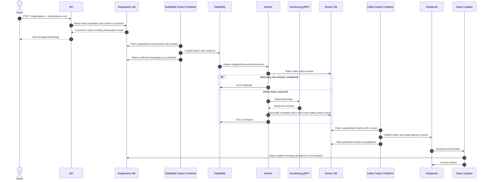

# Distributed Workflow

Distributed Workflow is an educational .NET system that models a reliable, asynchronous document-registration pipeline. A client submits an idempotent HTTP request, receives an operation identifier, and polls the operation while the command moves through PostgreSQL, RabbitMQ, gRPC, a second transactional outbox, Kafka-compatible Redpanda, and a status projection.

The project focuses on delivery guarantees, failure recovery, horizontal consumers, database-backed leases, micro-batching, and observable performance.

## Architecture

```mermaid
flowchart LR
    client[Client]
    lb[HAProxy]
    api[API replicas]
    registrationDb[(Registration PostgreSQL)]
    rabbitOutbox[Outbox Publisher replicas]
    rabbitmq[[RabbitMQ]]
    worker[Worker replicas]
    numbering[Numbering gRPC]
    workerDb[(Worker PostgreSQL)]
    kafkaOutbox[Kafka Outbox Publisher replicas]
    kafka[[Redpanda / Kafka API]]
    statusUpdater[Status Updater replicas]

    client -->|HTTP| lb
    lb --> api
    api -->|batch: operation + outbox| registrationDb
    registrationDb -->|claim with lease| rabbitOutbox
    rabbitOutbox -->|publisher confirms| rabbitmq
    rabbitmq -->|RegisterDocumentCommand| worker
    worker -->|ReserveNumber| numbering
    worker -->|batch: inbox + Kafka outbox| workerDb
    workerDb -->|claim with lease| kafkaOutbox
    kafkaOutbox -->|DocumentRegisteredEvent| kafka
    kafka -->|consumer group| statusUpdater
    statusUpdater -->|batch status update| registrationDb
```



The system uses two PostgreSQL databases with separate responsibilities:

- **Registration DB** stores client-visible operations and the RabbitMQ outbox.
- **Worker DB** stores the RabbitMQ consumer inbox and the Kafka outbox.

## Registration flow



## Reliability model

- The API uses a unique `Idempotency-Key`. Concurrent requests with the same key resolve to the same operation.
- The API commits `RegistrationOperation` and its RabbitMQ outbox message in one PostgreSQL transaction.
- RabbitMQ outbox dispatchers use leases and `FOR UPDATE SKIP LOCKED`, allowing multiple dispatchers and replicas to work without intentionally claiming the same row.
- RabbitMQ publisher confirms are awaited before an outbox row is marked as published.
- The Worker uses an inbox table to make redelivered commands idempotent. Inbox claims and completions are micro-batched.
- Completing an inbox message and creating its Kafka outbox event happen atomically in one PostgreSQL statement.
- Kafka outbox publishers claim batches with leases and wait for Kafka delivery reports before completing a batch in PostgreSQL.
- The Status Updater uses manual Kafka offset commits and an idempotent `Pending` to `Succeeded` update. A replay after a failed offset commit does not change an already completed operation.
- Worker failures are republished to delayed RabbitMQ retry queues. The current schedule is 1 second, then 10 seconds, then 60 seconds, with a limit of 10 processing attempts.
- Invalid messages and commands that exhaust their retry limit are rejected with `requeue: false` and routed to `registration.register.dlq` through the queue's dead-letter exchange.

These mechanisms provide **at-least-once delivery**, not global exactly-once processing. A publisher can still produce a duplicate if the broker persists a message but the process fails before recording that confirmation. Consumers therefore remain idempotent.

## Services

| Project | Responsibility | Interfaces |
|---|---|---|
| `DistributedWorkflow.Api` | Accepts registrations, batches PostgreSQL writes, returns idempotent operation results, and exposes status queries. | HTTP, Registration DB |
| `DistributedWorkflow.OutboxPublisher` | Claims the Registration DB outbox and publishes confirmed command batches. | Registration DB, RabbitMQ |
| `DistributedWorkflow.Worker` | Consumes commands, manages inbox leases, calls Numbering, and atomically creates Kafka outbox events. | RabbitMQ, Worker DB, gRPC |
| `DistributedWorkflow.Numbering.Grpc` | Generates registration numbers using a process-local counter. | gRPC |
| `DistributedWorkflow.KafkaOutboxPublisher` | Claims Worker DB outbox rows and publishes event batches with Kafka delivery reports. | Worker DB, Kafka API |
| `DistributedWorkflow.RegistrationStatusUpdater` | Consumes Kafka events in batches and projects successful completion into Registration DB. | Kafka API, Registration DB |
| `DistributedWorkflow.Migrations` | Applies EF Core migrations to both PostgreSQL databases and exits. | Registration DB, Worker DB |
| `DistributedWorkflow.LoadTests` | Generates configurable HTTP load with NBomber and writes local reports. | HTTP |

## Infrastructure

| Component | Role |
|---|---|
| HAProxy | Balances HTTP requests across API replicas. |
| PostgreSQL 16 | Runs independent Registration and Worker database instances. |
| RabbitMQ | Delivers commands, delayed retries, and dead-lettered failures. |
| Redpanda | Provides a single-node Kafka-compatible broker for integration events. |
| Prometheus | Scrapes service, database-client, RabbitMQ, HAProxy, and Redpanda metrics. |
| Grafana | Provisions the Prometheus data source and the `Pipeline Overview` dashboard. |

## Technology stack

- **Platform:** .NET 9, ASP.NET Core, Background Services
- **Data access:** PostgreSQL, Npgsql, Entity Framework Core migrations
- **Messaging:** RabbitMQ, Kafka-compatible Redpanda
- **Observability:** OpenTelemetry Metrics, Prometheus, Grafana
- **Testing:** xUnit v3, Moq, Testcontainers for .NET, `WebApplicationFactory`, NBomber
- **Deployment:** Docker and Docker Compose

## Quick start

### Prerequisites

- Docker Desktop with Docker Compose
- .NET 9 SDK for tests and running projects outside containers

Build and start the entire environment from the repository root:

```bash
docker compose --profile apps up -d --build
```

Compose waits for both PostgreSQL instances, runs the one-shot migrations container, creates the Kafka topic, and then starts the application services. Check their state with:

```bash
docker compose --profile apps ps --all
```

The `migrations` and `redpanda-init` containers should finish with exit code `0`. Application services should be running or healthy.

Verify the public API:

```bash
curl http://localhost:5268/health/ready
```

Follow the main pipeline logs:

```bash
docker compose --profile apps logs -f api outbox-publisher worker kafka-outbox-publisher registration-status-updater
```

Stop the environment while retaining database and broker data:

```bash
docker compose --profile apps down
```

Delete the environment **and all persisted PostgreSQL, Redpanda, Prometheus, and Grafana data** only when a clean state is intended:

```bash
docker compose --profile apps down -v
```

### Infrastructure-only mode

For debugging applications from an IDE, start only the infrastructure:

```bash
docker compose up -d
```

Development settings point application projects to the host ports in the table below. The dedicated migrations project requires both connection strings. For example, in PowerShell:

```powershell
$env:ConnectionStrings__RegistrationDb = "Host=localhost;Port=5433;Database=registration_db;Username=postgres;Password=postgres"
$env:ConnectionStrings__WorkerDb = "Host=localhost;Port=5434;Database=worker_db;Username=postgres;Password=postgres"

dotnet run --project DistributedWorkflow.Migrations/DistributedWorkflow.Migrations.csproj
```

When running the Worker directly, keep `ConnectionStrings__WorkerDb` set in its terminal. The other application projects contain their host-facing development connection settings in `appsettings.Development.json`.

## Local endpoints

| Component | URL or address |
|---|---|
| API and Swagger UI | <http://localhost:5268/swagger> |
| API liveness | <http://localhost:5268/health/live> |
| API readiness | <http://localhost:5268/health/ready> |
| HAProxy metrics | <http://localhost:8404/metrics> |
| Numbering gRPC | `https://localhost:7158` on the host; `http://localhost:5082` through Docker |
| RabbitMQ AMQP | `localhost:5673` |
| RabbitMQ Management | <http://localhost:15672> |
| Redpanda Kafka endpoint | `localhost:19092` |
| Redpanda Console | <http://localhost:8080> |
| Redpanda metrics | <http://localhost:9644/public_metrics> |
| Registration PostgreSQL | `localhost:5433`, database `registration_db` |
| Worker PostgreSQL | `localhost:5434`, database `worker_db` |
| Prometheus | <http://localhost:9090> |
| Grafana | <http://localhost:3000> |

The local RabbitMQ and PostgreSQL credentials are `guest` / `guest` and `postgres` / `postgres`, respectively. Grafana uses `admin` / `admin`. These credentials are for local development only.

## API usage

### Register a document

```http
POST /registrations
Idempotency-Key: registration-example-001
Content-Type: application/json

{
  "documentId": "document-123",
  "title": "Example document"
}
```

The API waits until the operation and outbox command are durably committed, then returns `202 Accepted`:

```json
{
  "operationId": "5103c020dff1475c90d1afbdbf9ccd4d",
  "status": "Pending"
}
```

Repeating the request with the same `Idempotency-Key` returns the original operation rather than creating another one. A missing or blank key returns `400 Bad Request`.

### Get registration status

```http
GET /registrations/5103c020dff1475c90d1afbdbf9ccd4d
Accept: application/json
```

An existing operation returns `200 OK`:

```json
{
  "operationId": "5103c020dff1475c90d1afbdbf9ccd4d",
  "status": "Succeeded"
}
```

The implemented state transition is `Pending` to `Succeeded`. An unknown operation identifier returns `404 Not Found`.

Runnable examples are available in [`DistributedWorkflow.Api.http`](DistributedWorkflow.Api/DistributedWorkflow.Api.http) and through Swagger UI.

## Configuration reference

ASP.NET Core maps double underscores in Compose environment-variable names to configuration section separators. For example, `WorkerBatch__MaxBatchSize` overrides `WorkerBatch:MaxBatchSize`. Values below are per replica unless stated otherwise.

### Local scale profile

The Compose `apps` profile is tuned as a multi-replica local demonstration. Important defaults currently include:

| Stage | Compose configuration |
|---|---|
| API | 3 replicas; registration batches up to 64 with a 5 ms maximum delay |
| RabbitMQ Outbox Publisher | 2 replicas; 3 dispatchers per replica; batches up to 100 |
| Worker | 4 replicas; RabbitMQ concurrency 64 per replica; inbox batches up to 32 with a 5 ms maximum delay |
| Kafka Outbox Publisher | 2 replicas; 2 dispatchers per replica; batches up to 500 |
| Status Updater | 2 replicas; 2 Kafka consumers per replica; batches up to 500 with a 10 ms maximum delay |
| Kafka topic | 12 partitions, replication factor 1 |

Batch sizes are upper bounds. A batch is dispatched earlier when its maximum delay expires. Increasing concurrency or replica counts does not guarantee more throughput when every container shares the same CPU, memory, and disk.

### API batching

| Compose parameter | Current value | Description |
|---|---:|---|
| `deploy.replicas` | 3 | Number of API containers behind HAProxy. Each replica has its own queue and database pool. |
| `RegistrationBatch__MaxBatchSize` | 64 | Maximum number of registration requests written in one PostgreSQL transaction. The actual batch can be smaller. |
| `RegistrationBatch__MaxBatchDelay` | 5 ms | Maximum time to collect more requests after the first request enters an empty batch. Lower values reduce low-load latency; higher values allow fuller batches. |
| `RegistrationBatch__Capacity` | 20,000 | Maximum number of requests waiting in one API replica's in-memory channel. When full, new writes wait and apply backpressure. |

### RabbitMQ Outbox Publisher

| Compose parameter | Current value | Description |
|---|---:|---|
| `deploy.replicas` | 2 | Number of independent publisher processes. |
| `Outbox__DispatcherCount` | 3 | Concurrent outbox loops inside each replica. The effective maximum is 6 dispatchers across the two replicas. |
| `Outbox__BatchSize` | 100 | Maximum number of outbox rows claimed and published by one dispatcher iteration. |
| `Outbox__LeaseDuration` | 20 s | Time for which claimed rows belong to a dispatcher. Another dispatcher can recover them after this lease expires if the owner crashes. It must exceed a normal batch's publish-and-complete time. |
| `Outbox__EmptyBatchDelay` | 100 ms | Delay before polling PostgreSQL again when no unpublished rows were found. A shorter delay reduces wake-up latency but increases empty database queries. |

### Worker

| Compose parameter | Current value | Description |
|---|---:|---|
| `deploy.replicas` | 4 | Number of RabbitMQ consumer processes. |
| `RabbitMq__ConsumerConcurrency` | 64 | Maximum concurrent RabbitMQ delivery callbacks and the prefetch count for each replica. Across four replicas, up to 256 deliveries can be in flight. |
| `WorkerBatch__MaxBatchSize` | 32 | Maximum size of each inbox claim batch and each inbox-completion/Kafka-outbox batch. The two pipelines batch independently. |
| `WorkerBatch__MaxBatchDelay` | 5 ms | Maximum collection window after the first claim or completion request enters a new batch. |
| `WorkerBatch__Capacity` | 2,048 | Capacity of each in-memory claim and completion channel. When a channel is full, RabbitMQ handlers wait instead of growing memory without a bound. |

### Kafka Outbox Publisher

| Compose parameter | Current value | Description |
|---|---:|---|
| `deploy.replicas` | 2 | Number of Kafka outbox publisher processes. |
| `Outbox__DispatcherCount` | 2 | Concurrent Worker DB outbox loops inside each replica, for an effective maximum of 4 dispatchers. |
| `Outbox__BatchSize` | 500 | Maximum number of Worker DB outbox rows claimed and submitted to the shared Kafka producer by one iteration. |

The Kafka Outbox Publisher's values not overridden by Compose come from `appsettings.json`: a 30-second lease, a 1-second empty-poll delay, and a 5-second error delay.

### Registration Status Updater

| Compose parameter | Current value | Description |
|---|---:|---|
| `deploy.replicas` | 2 | Number of Status Updater processes in the same Kafka consumer group. |
| `Kafka__ConsumerCount` | 2 | Kafka consumers created inside each replica. There are 4 consumers in total, and Kafka assigns topic partitions among them. |
| `Kafka__BatchSize` | 500 | Maximum events collected before one set-based PostgreSQL status update and offset commit. |
| `Kafka__GroupId` | `registration-status-updater` | Consumer-group identity. Replicas sharing this value divide partitions rather than processing every event independently. |

`Kafka:BatchDelay` defaults to 10 ms in `appsettings.json`. The `document-registered` topic has 12 partitions, so one consumer group cannot actively use more than 12 consumers for this topic.

### PostgreSQL connection pools

`Maximum Pool Size` in each connection string is a per-process limit, not a global PostgreSQL limit. API and Worker replicas currently allow up to 20 pooled connections each; publishers and Status Updater replicas allow up to 5 each. The theoretical total therefore grows when replicas are added, even if the observed number of used connections remains much lower.

## Load testing

`DistributedWorkflow.LoadTests` reads its target, injection rate, and steady-state duration from environment variables.

PowerShell example:

```powershell
$env:LOAD_TEST_BASE_URL = "http://localhost:5268"
$env:LOAD_TEST_RATE = "5000"
$env:LOAD_TEST_DURATION_SECONDS = "120"

dotnet run --project DistributedWorkflow.LoadTests/DistributedWorkflow.LoadTests.csproj -c Release
```

Bash example:

```bash
LOAD_TEST_BASE_URL=http://localhost:5268 \
LOAD_TEST_RATE=5000 \
LOAD_TEST_DURATION_SECONDS=120 \
dotnet run --project DistributedWorkflow.LoadTests/DistributedWorkflow.LoadTests.csproj -c Release
```

The scenario ramps to the configured rate for 30 seconds and then maintains that injection rate for the configured duration. NBomber writes HTML, Markdown, CSV, text, and log output under `reports/`.

### Reference result

The following run was recorded on 2026-09-12 with the load generator and all Docker containers sharing one Windows workstation:

| Metric | Result |
|---|---:|
| Target steady injection rate | 5,000 requests/second |
| Ramp | 30 seconds |
| Steady injection | 120 seconds |
| Total requests | 672,500 |
| Accepted | 672,500 |
| Failed | 0 |
| Overall RPS including ramp | 4,483.33 |
| Mean latency | 51.35 ms |
| p50 / p95 / p99 | 32.83 / 158.85 / 229.38 ms |
| Maximum latency | 593.54 ms |

This is a local reference measurement, not a universal capacity claim. Hardware, existing table size, PostgreSQL WAL and checkpoint state, Docker resource limits, and whether the load generator shares the application host all affect the result. A repeatable external benchmark over a wired connection is still required before treating this number as a deployment capacity limit.

## Testing

Run the API batching unit tests:

```bash
dotnet test DistributedWorkflow.Api.UnitTests/DistributedWorkflow.Api.UnitTests.csproj
```

Run the API integration tests:

```bash
dotnet test DistributedWorkflow.Api.IntegrationTests/DistributedWorkflow.Api.IntegrationTests.csproj
```

The current unit tests cover the bounded registration queue, batch reader, and batch writer behavior. Integration tests use Testcontainers PostgreSQL and cover health checks, operation/outbox persistence, status queries, and sequential and concurrent idempotency scenarios.

Worker, broker, Kafka, and complete end-to-end failure scenarios do not yet have automated integration coverage.

## Observability

Every application service exposes OpenTelemetry Prometheus metrics on its internal HTTP endpoint. Prometheus discovers individual Compose replicas and scrapes them every five seconds.

Grafana is provisioned automatically at <http://localhost:3000>. Sign in with `admin` / `admin` and open the `Pipeline Overview` dashboard. It includes:

- service and broker health;
- end-to-end pipeline throughput;
- RabbitMQ ready and unacknowledged messages;
- API and Worker latency breakdowns;
- Registration DB and Worker DB connection-pool and command metrics;
- per-replica RabbitMQ and Kafka outbox throughput;
- outbox batch sizes, durations, failures, and lease conflicts;
- Status Updater throughput and batch metrics;
- Redpanda produce/fetch rates, request latency, unavailable partitions, CPU, memory, disk usage, and consumer-group lag.

Application logs are written to standard output and can be read with `docker compose logs`. Distributed tracing, centralized log storage, and alerting are not implemented yet.

## Known limitations

- Numbering uses a process-local, non-idempotent counter. Its state is lost on restart, it cannot be safely scaled to multiple replicas, and a retry after reserving a number can consume another number.
- The reserved registration number is not yet persisted in the operation or exposed through the status API.
- An operation that exhausts RabbitMQ retries remains `Pending`; there is no failed-status projection or automated DLQ recovery workflow.
- Kafka invalid events are logged and skipped, but there is no Kafka dead-letter topic.
- Completed inbox and outbox records have no retention or archival process, so sustained load grows the tables and their indexes indefinitely.
- Registration DB updates and Kafka offset commits in Status Updater are not atomic. The current monotonic update is replay-safe, but the service does not provide transactional exactly-once consumption.
- PostgreSQL, RabbitMQ, Redpanda, and Numbering are single-node development deployments without failover.
- Message contracts are duplicated between projects instead of being versioned and distributed as shared contracts.
- Authentication, authorization, secret management, production TLS, distributed tracing, centralized logging, and alerting are outside the current implementation.

## Roadmap

### Reliability and domain completion

- [ ] Persist registration numbers and make Numbering durable and idempotent.
- [ ] Project terminal failures into an explicit `Failed` operation state and define a DLQ replay procedure.
- [ ] Add a Kafka dead-letter strategy for invalid events.
- [ ] Add retention or partitioning for completed inbox and outbox records.

### Testing and delivery

- [ ] Add Worker integration tests for inbox leases, retries, duplicate delivery, and atomic Kafka outbox creation.
- [ ] Add Kafka publisher and Status Updater integration tests.
- [ ] Add end-to-end tests that interrupt each publish/commit boundary and verify recovery.
- [ ] Add GitHub Actions for build, tests, and Docker image validation.

### Operations and scale

- [ ] Add distributed tracing and correlation across HTTP, RabbitMQ, gRPC, and Kafka.
- [ ] Add centralized structured logs, alert rules, and operational runbooks.
- [ ] Repeat benchmarks with a wired external load generator and document the host specifications and test preconditions.
- [ ] Evaluate batch or range-based number reservation before scaling Numbering horizontally.
- [ ] Evaluate multi-node broker and database deployments only after measuring a real deployment bottleneck.
